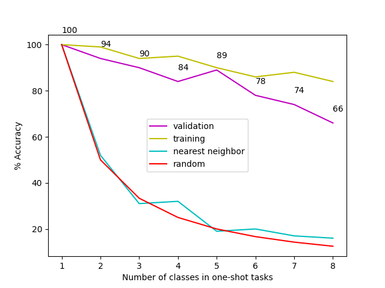

# Changes to project

After talking to my advisor, Hernisa Kacorri, who has extensive experience creating technologies for ASL recognition, we have changed the focus of our project from what we had in the proposal. The linguistic aspect of ASL translation is nontrivial, and as we do not have someone with that background on our team, be believed it was best to scope down the project.  

The project's goal is now a personalized gesture recognition for potential control of smart home technologies, such as Google Home or Alexa. We believe this is still a compelling use case as this technology does not yet exist. These gestures may be mapped to ASL words if users would like, but it is no longer limited to ASL. 

# Work completed 

## 1. Data collection 

### Determined 8 pre-defined gestures 
  

### Collected gesture samples

- Recorded each gesture for 1 second about a foot away from the sensor, with 15 total samples per gesture. [Video](videos/recording_all.mov)

<iframe width="560" height="315" src="https://www.youtube.com/embed/Y1lpfWaKTs4" title="YouTube video player" frameborder="0" allow="accelerometer; autoplay; clipboard-write; encrypted-media; gyroscope; picture-in-picture" allowfullscreen></iframe>

Equipment used: 
- Sensor: [ReSpeaker 6-Mic Circular Array Kit](https://www.seeedstudio.com/ReSpeaker-6-Mic-Circular-Array-Kit-for-Raspberry-Pi.html)
- [Raspberry Pi 3b](https://www.raspberrypi.com/products/raspberry-pi-3-model-b/)

## 2. Data pre-processing 

- Implemented six types of spectrogram / image generation using Python library `librosa` 
    - Spectrogram 
    - Mel-scaled spectrogram
    - Mel-frequency spectral coefficients 
    - Chromagram
    - Short-time Fourier transform 
    - Chromagram computed using short-time fourier transform 


## 3. Gesture classification 

- Implemented Siamese networks/few shot learning using Python library `keras` 
- Created end-to-end ML pipeline  
- Created comparative visualizations using `matplotlib` to track performance 
- Resulted in approximately ~95% performance using Mel spectrogram 

Documentation: 
- [Code documentation](https://github.com/tinydeltas/cmsc730-project)
- Output of model 

```
Model: "model"
__________________________________________________________________________________________________
Layer (type)                    Output Shape         Param #     Connected to                     
==================================================================================================
input_1 (InputLayer)            [(None, 100, 100, 3) 0                                            
__________________________________________________________________________________________________
input_2 (InputLayer)            [(None, 100, 100, 3) 0                                            
__________________________________________________________________________________________________
sequential (Sequential)         (None, 4096)         27426112    input_1[0][0]                    
                                                                 input_2[0][0]                    
__________________________________________________________________________________________________
lambda (Lambda)                 (None, 4096)         0           sequential[0][0]                 
                                                                 sequential[1][0]                 
__________________________________________________________________________________________________
dense_1 (Dense)                 (None, 1)            4097        lambda[0][0]                     
==================================================================================================
Total params: 27,430,209
Trainable params: 27,430,209
Non-trainable params: 0
``` 

- Sample training output for n_iterations = 100 

```
Starting training process!
-------------------------------------
Time for 10 iterations: 7.9494469165802
Evaluating model on 7 random 8 way one-shot learning tasks ... 

Got an average of 71.42857142857143% 8 way one-shot learning accuracy 

Current best: 71.42857142857143, previous best: -1
Saving weights to: ./tmp/11_03_2021_20:36:47/models/chroma_model_weights.h5 

iteration 10
training loss:  [2.9637935161590576, 1.0]
Time for 20 iterations: 16.1446316242218
Evaluating model on 7 random 8 way one-shot learning tasks ... 

Got an average of 100.0% 8 way one-shot learning accuracy 

Current best: 100.0, previous best: 71.42857142857143
Saving weights to: ./tmp/11_03_2021_20:36:47/models/chroma_model_weights.h5 

iteration 20
training loss:  [2.9288105964660645, 0.7142857313156128]
Time for 30 iterations: 23.66047167778015
Evaluating model on 7 random 8 way one-shot learning tasks ... 

Got an average of 71.42857142857143% 8 way one-shot learning accuracy 

iteration 30
training loss:  [2.6476476192474365, 0.8571428656578064]
Time for 40 iterations: 30.897026777267456
Evaluating model on 7 random 8 way one-shot learning tasks ... 

Got an average of 28.571428571428573% 8 way one-shot learning accuracy 

... 

Got an average of 100.0% 1 way one-shot learning accuracy 

Evaluating model on 20 random 1 way one-shot learning tasks ... 

Got an average of 100.0% 1 way one-shot learning accuracy 

Evaluating nearest neighbour on 20 unique 1 way one-shot learning tasks ...
/Users/tinydeltas/projects/cmsc730-project/venv/lib/python3.7/site-packages/numpy/core/fromnumeric.py:87: RuntimeWarning: overflow encountered in reduce
  return ufunc.reduce(obj, axis, dtype, out, **passkwargs)
Evaluating model on 20 random 2 way one-shot learning tasks ... 

Got an average of 95.0% 2 way one-shot learning accuracy 

... 

Evaluating model on 20 random 6 way one-shot learning tasks ... 

Got an average of 100.0% 6 way one-shot learning accuracy 

Evaluating nearest neighbour on 20 unique 6 way one-shot learning tasks ...
Evaluating model on 20 random 7 way one-shot learning tasks ... 

Got an average of 85.0% 7 way one-shot learning accuracy 

Evaluating model on 20 random 7 way one-shot learning tasks ... 

Got an average of 100.0% 7 way one-shot learning accuracy 

Evaluating nearest neighbour on 20 unique 7 way one-shot learning tasks ...
Evaluating model on 20 random 8 way one-shot learning tasks ... 

Got an average of 90.0% 8 way one-shot learning accuracy 

Evaluating model on 20 random 8 way one-shot learning tasks ... 

Got an average of 85.0% 8 way one-shot learning accuracy 

Evaluating nearest neighbour on 20 unique 8 way one-shot learning tasks ...
```

### Results 

Composite (from run on 10/31)


Mel spectrogram (from run on 11/03)


Chromagram (from run on 11/03)



Chromagram with STFT (from run on 11/03)


## Work to be done 

## Create streaming data collection interface 

- Live gesture detection 
- Gesture boundary detection

### Map gestures to verbal commands

Lights
- Open ("Turn on the lights") 
- Close ("Turn off the lights")

Music
- Minimize (Volume down on music)
- Maximize (Volume up on music)

Calls
- No (hang up a call)

Misc 
- Tap (Check my calendar today)
- Cut (what's the weather)
- Switch (what's the time) 

### Collect more samples 

- Compare performance with other microphones, such as on-board microphone  

### Improve noise data sample pre-processing

- Background noise removal 
- Distance resiliency 
- Hi/lo pass filter
- Angle of receiving microphone resiliency 

### If time: 
- Implement UX for training and validation sample collecting in app 
- ML experiments 
    - LSTM implementation 
    - MLP implementation 
    - Transfer learning implementation 
        - Dataset discovery